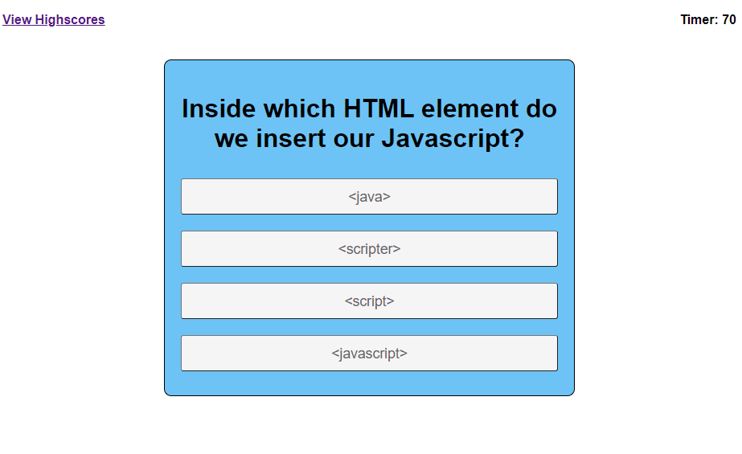

# Code Quiz

In this website I have a Javascript code quiz which allows the user to click on buttons corresponding to questions. If these questions are correct it will not take away time but if it is incorrect the user will lose 10 seconds. After all questions are answered or time has expired the website brings you to a submit screen. This allows the user to enter their initials and see the highscore table.

# Website features 

[Live website link](https://mikemonihan.github.io/Code_Quiz/)

[Live github repo link](https://github.com/MikeMonihan/Code_Quiz)